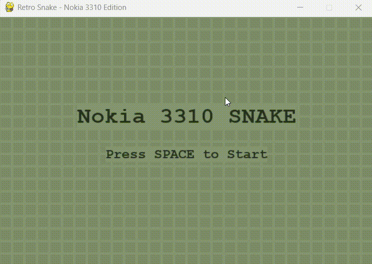

# 🐍 Python-NOKIA-3310-SnakeGame

A classic, retro-style implementation of the beloved Nokia 3310 Snake game, written entirely in Python using **Pygame**. 

Experience the nostalgia of pure, simple, grid-based gameplay with an authentic LCD screen aesthetic!

<div align="center">
  
</div>

---

## ✨ Features

- **Retro LCD Aesthetic** 📺: Accurately simulates the unlit and lit pixels of classical monochrome displays, creating an authentic hardware grid illusion.
- **Classic Gameplay** 🕹️: Accurate grid-based movement, boundary walls, and retro apple-eating mechanics.
- **Title & Game Over Screens** 🎮: Polished minimal menus to start, pause, and retry your games.
- **Clean UI & Simple Controls** ⌨️: Arrow keys are all you need to set new high scores.

## 🚀 Getting Started

Follow these minimal instructions to get the grid snake running on your local machine instantly.

### Prerequisites

You need Python 3.x installed on your computer. You also need to install `pygame`.

### Installation

1. **Clone the repository** (or download the files):
   ```bash
   git clone https://github.com/uttam102/Python-NOKIA-3310-SnakeGame.git
   cd Python-NOKIA-3310-SnakeGame
   ```

2. **Install the required dependencies**:
   ```bash
   pip install pygame
   ```

### Running the Game

Launch the game by running the Python script:
```bash
python snake.py
```

## 🎮 Controls

* **`Arrow Keys`** : Move the snake (Up, Down, Left, Right)
* **`SPACE`** : Start game from Title Screen
* **`C`** : Play again after Game Over
* **`Q`** : Quit the game

## 🖼️ Game Design Details

The game utilizes a special "Pixel Grid" rendering where each block is slightly padded to mimic vintage dot-matrix LCD screens. The colors used are strictly chosen to map directly to the classic Nokia yellowish-green hue, with dark pixels taking a slate-olive tint. 

Enjoy your trip down memory lane! 🚀
